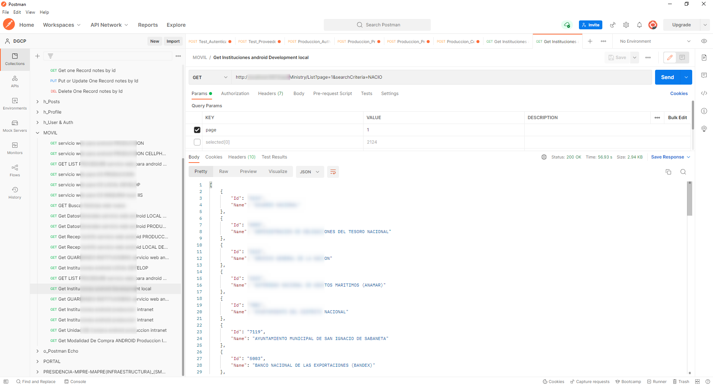
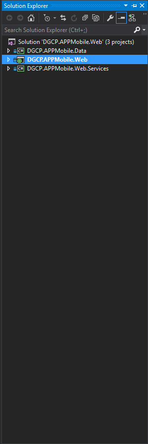
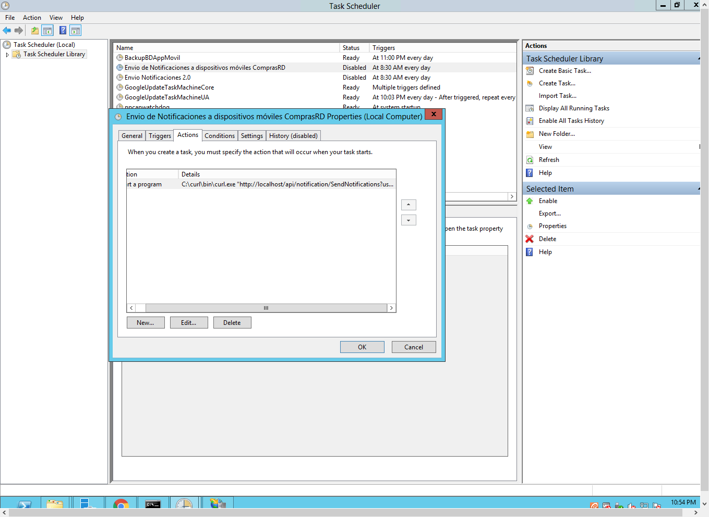

# Develop and maintain a Restful APIs service for the mobile application

The goal was to develop and maintain a Rest APIs service for
 the mobile application, providing news information, purchase modalities, processes, process articles, and State Institutions, among other things.

Technology used:
* IDE: **Visual Studio 2015**
* App: **Web API /  REST API**
* Standard file format: **JSON**
* Language: **C# / Framework 4.5**
* Database: **MS SQL SERVER 2016, T-SQL (views, store procedure)**

To perform this task, I created a Restful Apis web service project in C# / Framework 4.5 in which I had the following endpoints:

State Institutions: at this endpoint, you can obtain all the information such as the name, address, etc., of the Dominican state institutions.

Processes: at this endpoint, you can obtain all the information about the requirements to apply to the purchase offer published by a government institution.

Process articles: in this endpoint, you can obtain all the information about the articles of the published process.

News: In this endpoint, you get the latest news relevant to the DGCP.

It has pagination implemented with no more than 30 records per pagination.

To make requests use Postman

For database connection use Linq; Store precedences and views to decouple database queries with the API.

##### Screenshots of the System

